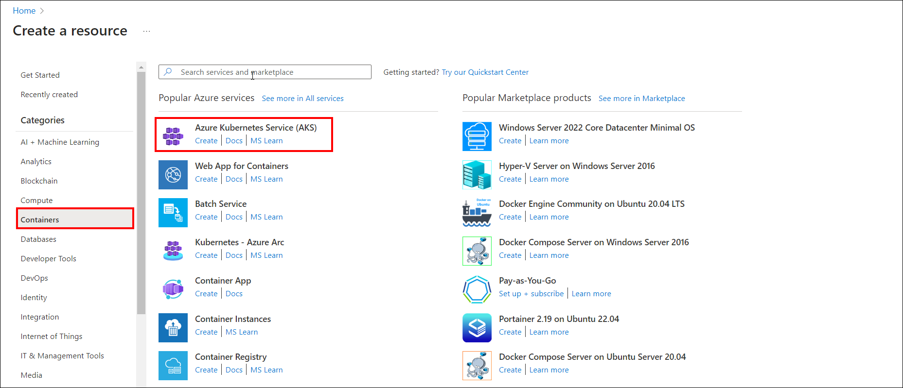
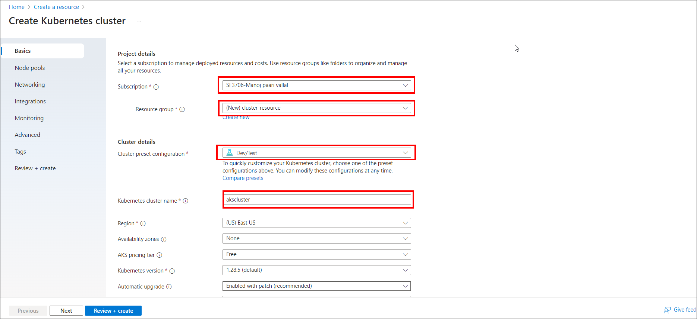
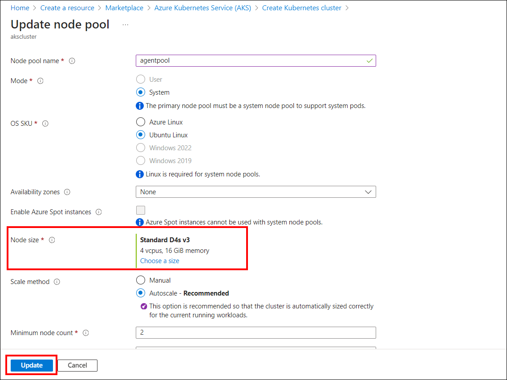
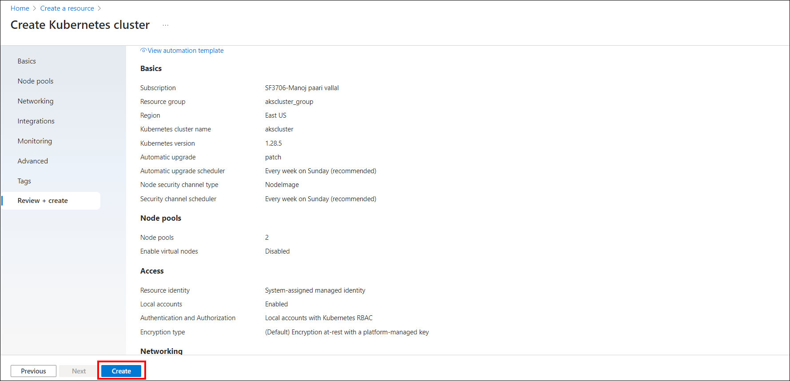

# Deploy an AKS cluster and establish a connection to your machine.
To create a Kubernetes cluster in Microsoft Azure Kubernetes Service (AKS) for deploying Bold BI, follow these steps:

1. On the Azure portal home page, click on `Create a resource`.
    
2.  Under the Categories section, choose `Containers` and then `Azure Kubernetes Service (AKS)`.
    
3. On the Basics tab, set up the following options:

    **In the Project details section:**
    Choose an Azure Subscription and Create an Azure Resource group, such as "cluster-resource".

    **In the Cluster details section:**
    Choose the Cluster preset configuration as "Dev/Test". Specify the Kubernetes cluster name (e.g., akscluster), choose a Region, set the Availability zones to None, select the Free pricing tier, leave the default Kubernetes version, enable Automatic upgrades with patch, and keep the Authentication and authorization setting as Local accounts with Kubernetes RBAC and then click `Next`. 
    
4. Navigate to the Node Pool tab and adjust the node size based on the [system configuration requirements](https://help.boldbi.com/deploying-bold-bi/deploying-in-kubernetes/recommended-system-configuration/) for Kubernetes.
    

6. Click on `Review + create` to validate the cluster configuration. Once the validation is complete, click on `Create` to create the AKS cluster.
    
7. You can also refer to this link for instructions on creating a Kubernetes cluster in Microsoft Azure Kubernetes Service (AKS) to deploy Bold BI: [link](https://docs.microsoft.com/en-us/azure/aks/kubernetes-walkthrough-portal) 

8. Once the cluster is created, you can connect to it by following this link: [link](https://docs.microsoft.com/en-us/azure/aks/kubernetes-walkthrough-portal#connect-to-the-cluster)

