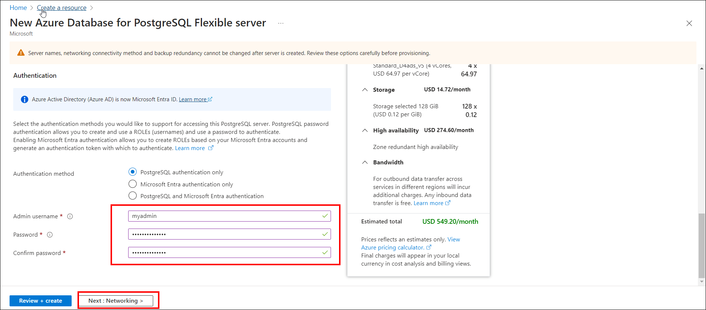

# Configure the database server on Microsoft Azure
Deploy the database server on an AKS cluster using two methods: 
<ul>
<ol>

a. [Configure Database Server Manually on AKS cluster ](azure-database-setup.md/#configure-database-server-manually-on-aks-cluster)

b. [Configure the managed database server on Azure](azure-database-setup.md/#configure-a-managed-database-service)
</ol>
</ul>

## Configure Database Server Manually on AKS cluster 

1. To install PostgreSQL on AKS cluster refer this [PostgreSQL Database File](https://learn.microsoft.com/en-us/answers/questions/721951/deploy-postgresql-on-aks) 
2. To install MS SQL on AKS cluster download this [MS SQL Database File](https://learn.microsoft.com/en-us/sql/linux/quickstart-sql-server-containers-azure?view=sql-server-ver16&tabs=kubectl)
3. To install My SQL on AKS cluster download this [My SQL Database File](https://dev.mysql.com/doc/mysql-operator/en/mysql-operator-installation-helm.html)
 
      
## Configure a Managed Database Service
Setting up a managed database service on Microsoft Azure involves configuring a database system provided by Azure. 

**Setting up an Azure Database for PostgreSQL**

  To set up a PostgreSQL database on Azure with the desired configurations, follow these detailed steps:

  - Click on `create a resource`, navigate to the services list, select `Database`, and then choose the Azure Database for PostgreSQL option.
       
    
  - Proceed to enter the required information to establish your Database:
    - In the basic settings, select your subscription, pick an existing resource group or make a new one, input a name for your PostgreSQL server, and select a region.
      
    - For server settings, select a pricing tier (such as Basic, General Purpose, or Memory Optimized), choose a PostgreSQL version, and create a username and password for the server admin. In the compute + storage section, activate the option for Geo-redundancy.
      
      
    - In the networking section, select your preferred connectivity method (like public or private endpoint), set up firewall rules, and ensure the box is checked to permit server access. Afterward, click the `Review and create` button.
      
    - Use the server name, username, and password you chose during setup to connect to your new database.
      
  - For further guidance, you can refer to the following link: [Quickstart: Create an Azure Database for PostgreSQL server in the Azure portal](https://learn.microsoft.com/en-us/azure/postgresql/flexible-server/quickstart-create-server-portal)

**Instructions:** 
  - To create a MySQL database in Azure, follow the instructions in this [link](https://learn.microsoft.com/en-us/azure/mysql/flexible-server/quickstart-create-server-portal).
  - To create a MS SQL database in Azure, follow the instructions in this [link](https://learn.microsoft.com/en-us/azure/azure-sql/database/single-database-create-quickstart?view=azuresql&tabs=azure-portal).

