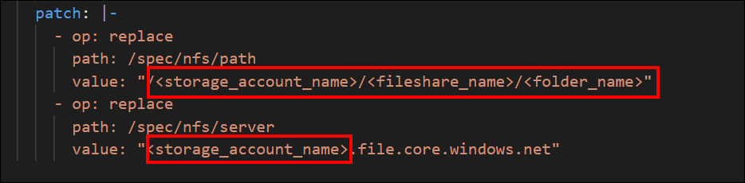
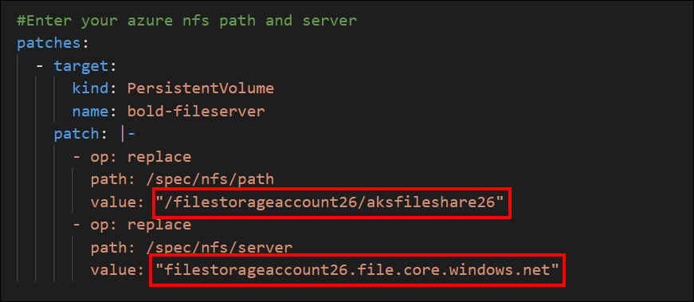
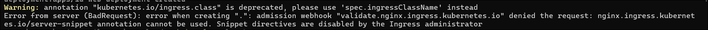
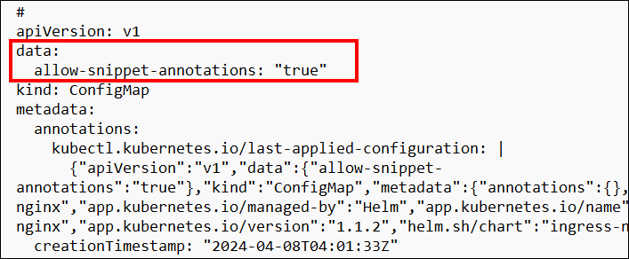

# Deployment using kubectl

To deploy Bold BI on Azure Kubernetes Service (AKS) using kubectl, you need to have the following prerequisites:

**1. kubectl**

[Install kubectl](https://kubernetes.io/docs/tasks/tools/#kubectl), the Kubernetes command-line tool, which is used to interact with Kubernetes clusters.

**2. Azure Kubernetes Service (AKS)**
 
Refer to this [link](aksdocument.md) for setting up an AKS cluster on Microsoft Azure.

**3. File Share**

 Configure a [File share](fileshare.md) that will be used by Bold BI for storing application data and configurations.

**4. Database** 

Choose and set up a  [database](azure-database-setup.md) for Bold BI, such as Microsoft SQL Server 2012+, PostgreSQL, or MySQL. This database will store the application data.

**5. Load Balancer** 

Currently we have provided support for [`Nginx`](https://kubernetes.github.io/ingress-nginx/deploy/#azure) and [`Istio`](https://istio.io/latest/docs/setup/install/) as Load Balancers in Bold BI.

**6. Web Browser**

 Ensure you have a compatible web browser installed, such as Microsoft Edge, Mozilla Firefox, or Chrome, to access the Bold BI application once deployed.

# Bold BI on Microsoft Azure Kubernetes Service
1. Download the Kustomization.yaml file below for Bold BI deployment in AKS. <a href="kustomization.yaml" download="kustomization.yaml"> Download YAML File</a>
2. Create a Kubernetes cluster in Microsoft Azure Kubernetes Service (AKS) to deploy Bold BI.
3. Create a File share instance in your storage account and note the File share name to store the shared folders for application usage.
4. Create a Database.
5. Open the Kustomization.yaml file that was downloaded in Step 1. Replace the storage account name and file share name noted in the steps above with <storageaccountname> and <file_share_name>, respectively, in the file.
    
    
6. Connect with your Microsoft AKS cluster.
7. After connecting with your cluster, deploy the latest Nginx ingress controller to your cluster using the following command.
    ```bash 
    kubectl apply -f https://raw.githubusercontent.com/kubernetes/ingress-nginx/controller-v1.10.0/deploy/static/provider/cloud/deploy.yaml
8. Run the following command to obtain the ingress IP address.
    ```bash 
    kubectl get service/ingress-nginx-controller -n ingress-nginx
9. After obtaining the External IP address, replace the app-base URL with your External IP address.
    
10. Navigate to the folder where the deployment file were downloaded from Step 1.
11. Run the following command to deploy Bold BI application on AKS cluster
    ```bash
    kubectl apply -k .
12. If you encounter an issue such as "snippet annotation cannot be used because snippet directives are disabled by the Ingress administrator," then edit the config file and change "allow-snippet-annotation" to true.
    
    
    Use the Below command to Edit config Map file 
    ```bash
    kubectl edit cm ingress-nginx-controller -n ingress-nginx

13. Again apply the step 11. Please wait for some time until the Bold BI On-Premise application is deployed to your Microsoft AKS cluster.

14. Use the following command to get the pods status.
    ```bash 
    kubectl get pods -n bold-services

15. Wait until you see the applications running. Then, use the DNS or ingress IP address you obtained from Step 10 to access the application in the browser.

16. Configure the Bold BI On-Premise application startup to utilize the application. Please refer to the following [link](https://help.boldbi.com/embedded-bi/application-startup) for more details on configuring the application startup.
