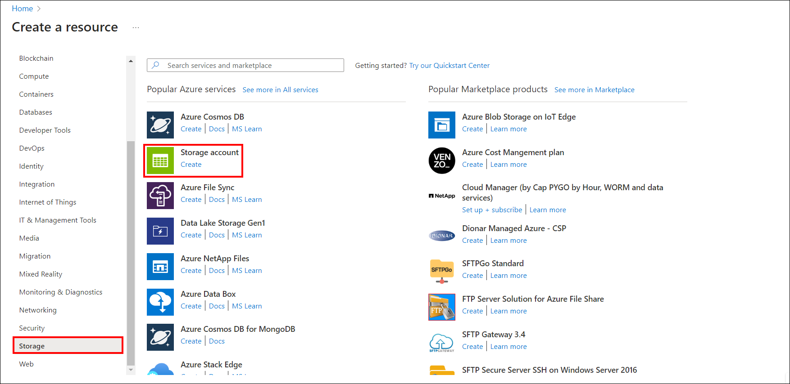
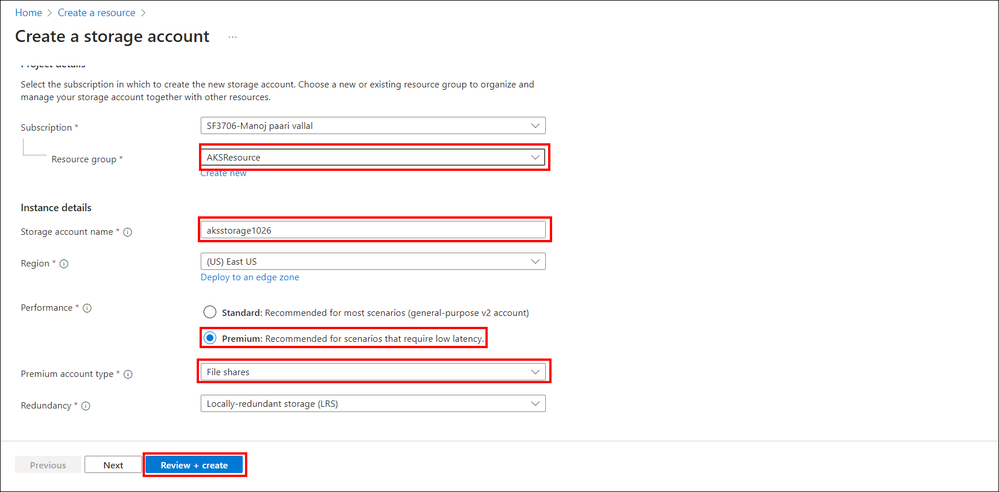
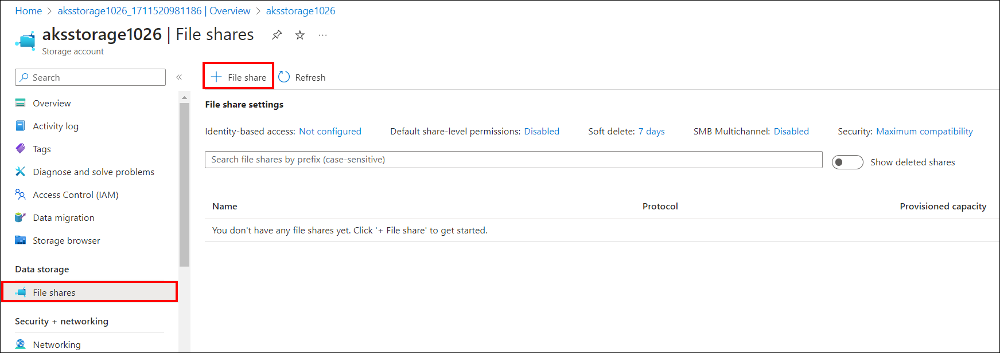
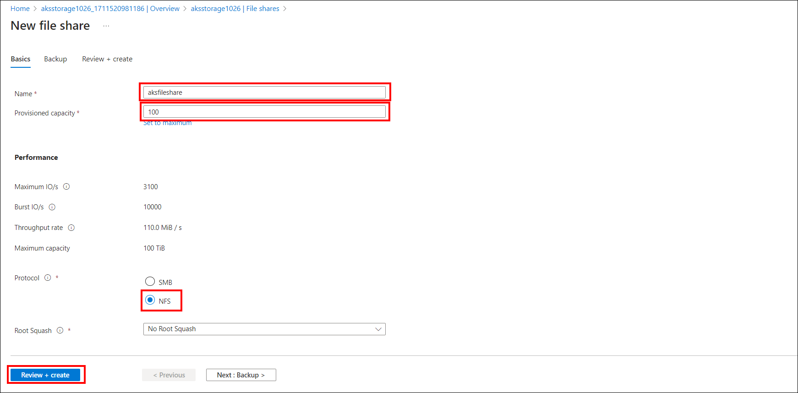
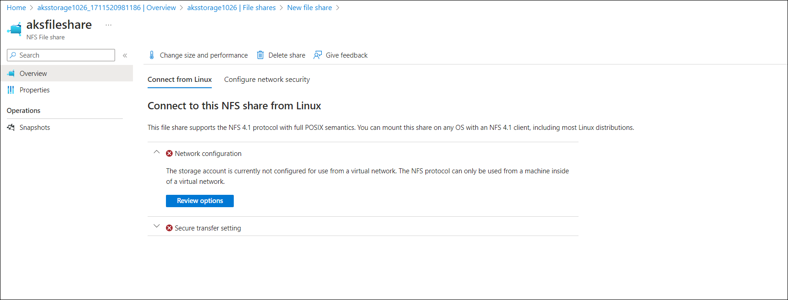
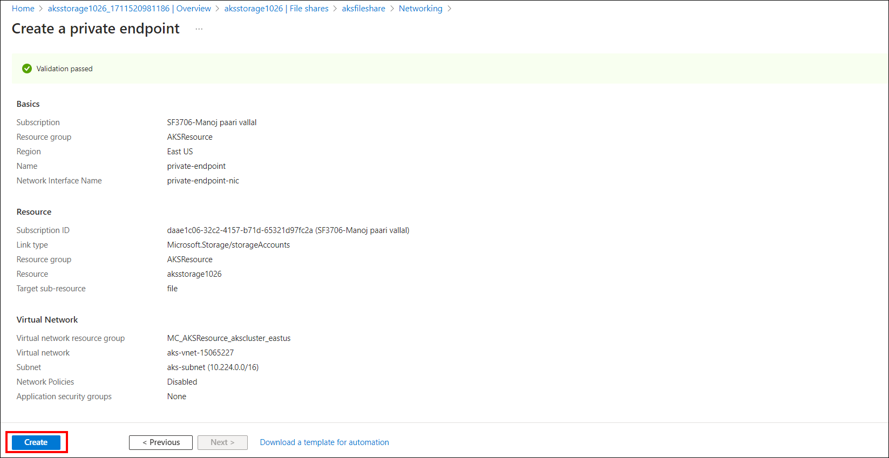
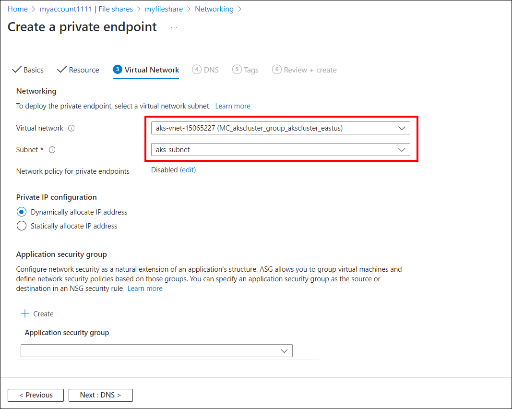
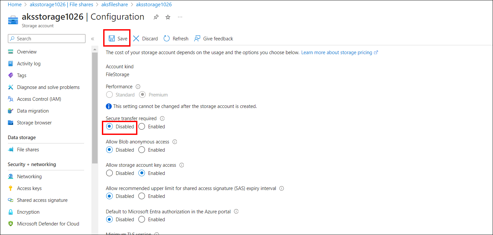

# Create a Storage Account and a File Storage  on Azure

Follow these steps to create a storage account and a File Storage on Azure that will be used by Bold BI for storing application data and configurations.

## Create a storage account

1. Click on "+ create a resource" in the Azure portal, then search for "Storage account" and select it.
    
    
2. On the Basics tab, set up the following options:

    **In the Project details section:**
    Choose the Azure subscription for the storage account creation. If you have only one subscription, it should be pre-selected as the default. If you want to create a new resource group, select `Create new` and enter a name, such as `myresourcegroup`.
    **Under Instance details:**
    Specify a name for the storage account and make a note of it for later use. Select the desired region for creating the storage account. For Performance, choose `Premium`. For Redundancy, select `Locally redundant storage (LRS)`.
    
3. Click on `Review + create` to validate your settings. Once the validation is complete, click on `Create` to initiate the creation process.
4. For a detailed explanation, please refer to this [link](https://learn.microsoft.com/en-us/azure/storage/common/storage-account-create?tabs=azure-portal)

## Create an Azure file share

1. Choose the storage account you created in the previous step. Navigate to the storage account page and select `File shares` in the Data storage section.In the menu at the top of the File shares page, click on `+ File share`. 
    
2. In the `Name` field, enter `myfileshare`. Specify the `Provisioned capacity` based on your requirements. Select `NFS` in the protocol section. Finally, click on `Review and Create`.
    
3. After Creation, you may face the issue shown in below image. Click on the `Review option`.
Then, we have to create a private endpoint. Enter the name of the private endpoint and click `Next`.
    
    
4. In the Virtual Network tab, ensure that the selected subnet and virtual network match the network of your AKS cluster that you created earlier. Then click on `Next`. In Review + create tab, Once the validation is complete, click on `Create`.
    
5. Next, in the Secure Transfer setting, disable secure transfer and save the changes.
    
6. For a detailed explanation, please refer to this [link](https://learn.microsoft.com/en-us/azure/storage/files/storage-how-to-use-files-portal?tabs=azure-portal)
    